# Developer Workflow Sequences: Using AI Coding Agents

This document shows detailed step-by-step workflows for using Cursor and Claude Code with the setup from the main guide and specification templates.

## Table of Contents
1. [Overview: How Context Loading Works](#overview)
2. [Technical Design Workflow](#technical-design)
3. [Feature Implementation Workflow](#feature-implementation)
4. [Bug Fix Workflow](#bug-fix)
5. [Refactoring Workflow](#refactoring)
6. [Testing Strategy Workflow](#testing)
7. [CI/CD Pipeline Workflow](#cicd)

---

## Overview: How Context Loading Works {#overview}

### Cursor Context Loading
- ✅ **Automatic**: `.cursor/rules/always.md` loads on every interaction
- ❌ **Manual**: Specifications must be explicitly referenced
- ❌ **Manual**: Memory bank must be explicitly mentioned or included in rules

### Claude Code Context Loading
- ✅ **Automatic**: `CLAUDE.md` loads when Claude Code starts
- ✅ **Automatic**: Can search project structure
- ❌ **Manual**: Specifications must be explicitly mentioned
- ❌ **Manual**: Memory bank must be explicitly referenced

---

## Technical Design Workflow {#technical-design}

### Detailed Cursor Flow

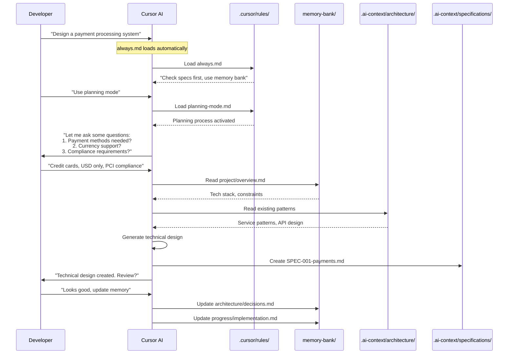

### Detailed Claude Code Flow

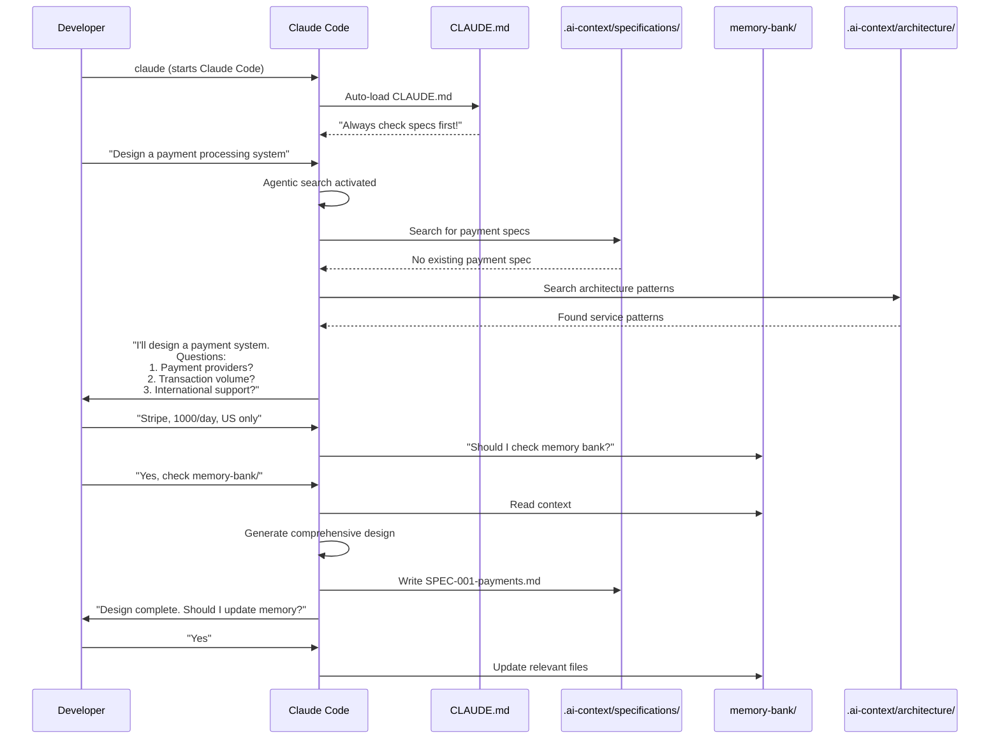

---

## Feature Implementation Workflow {#feature-implementation}

### Detailed Cursor Implementation Flow

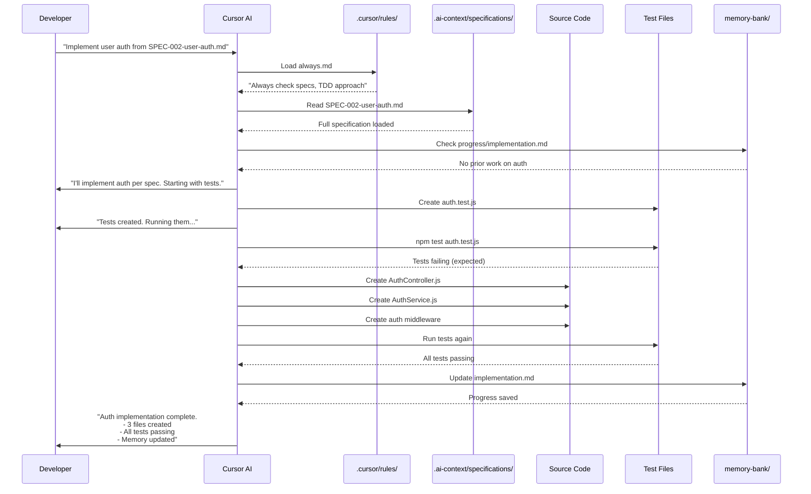

### Detailed Claude Code Implementation Flow

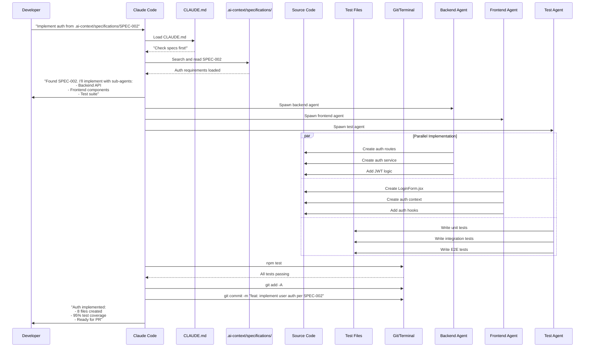

---

## Bug Fix Workflow {#bug-fix}

### Detailed Cursor Bug Fix Flow

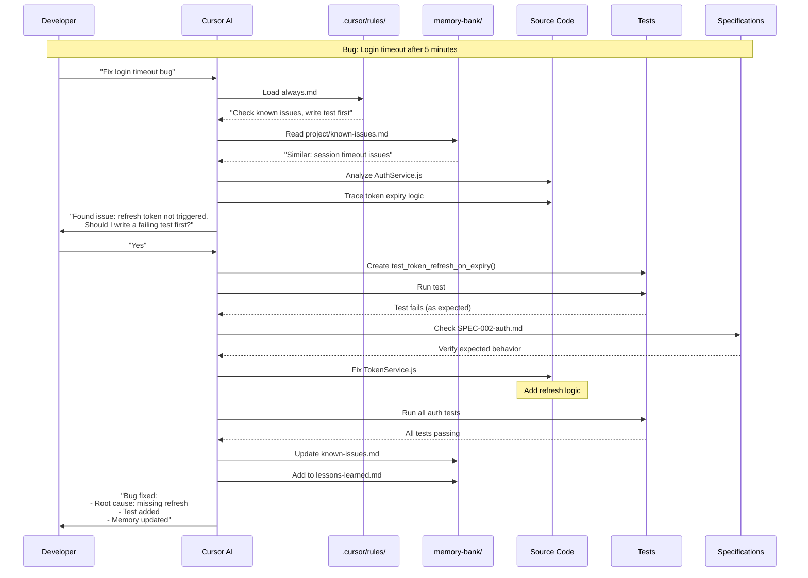

### Detailed Claude Code Bug Fix Flow

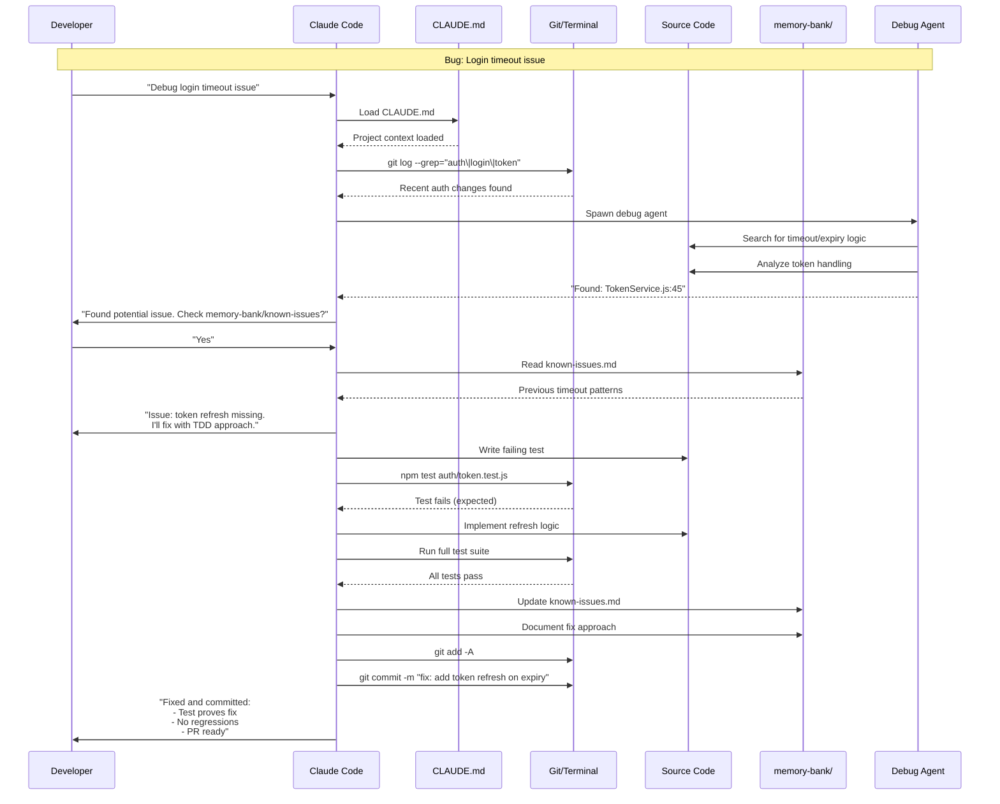

---

## Refactoring Workflow {#refactoring}

### Detailed Cursor Refactoring Flow

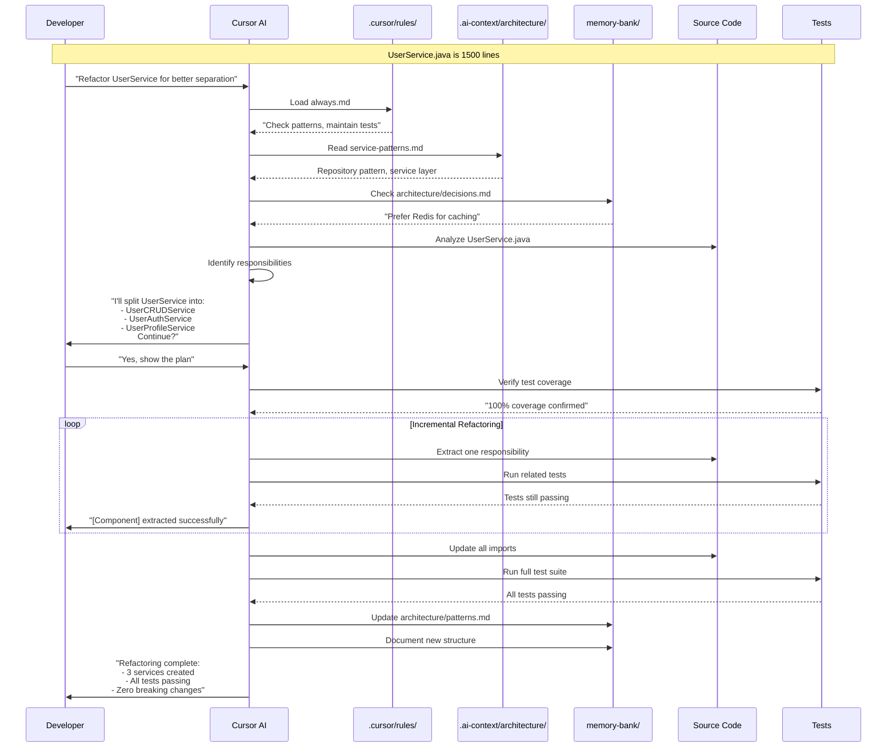

### Detailed Claude Code Refactoring Flow

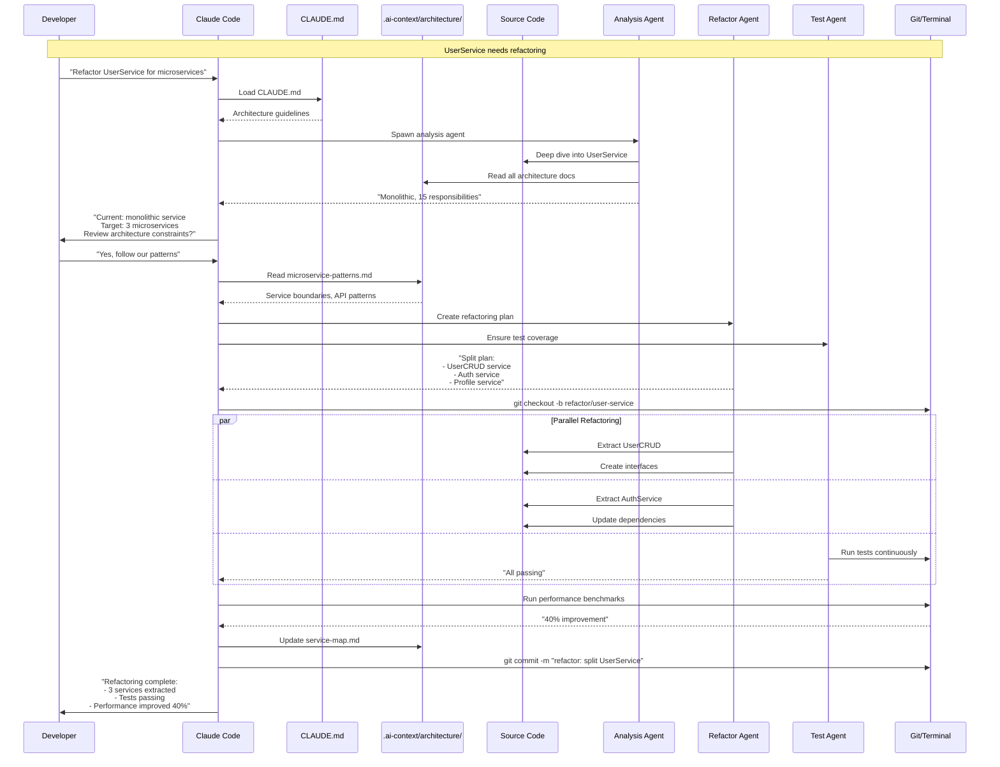

---

## Testing Strategy Workflow {#testing}

### Detailed Cursor Testing Flow

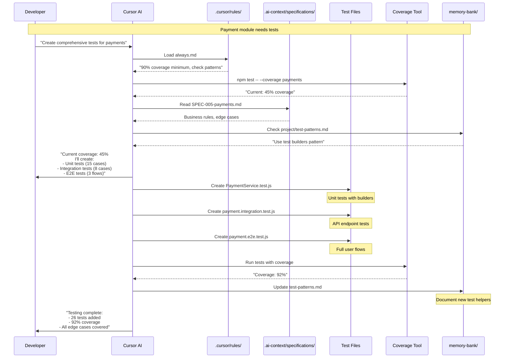

### Detailed Claude Code Testing Flow

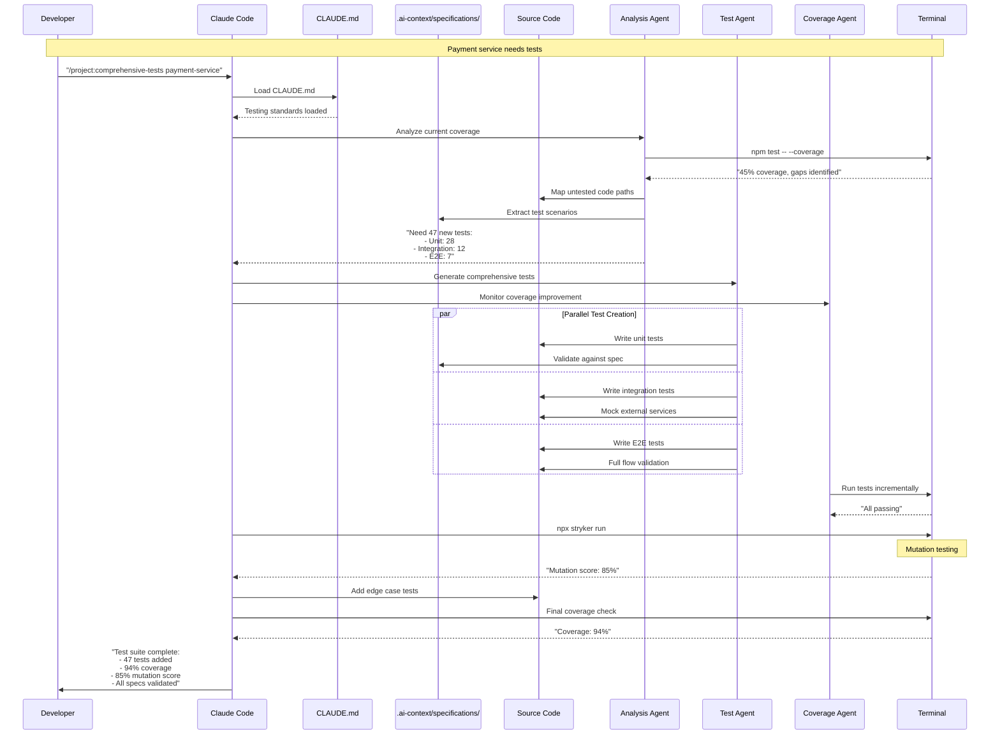

---

## CI/CD Pipeline Workflow {#cicd}

### Detailed Cursor CI/CD Flow

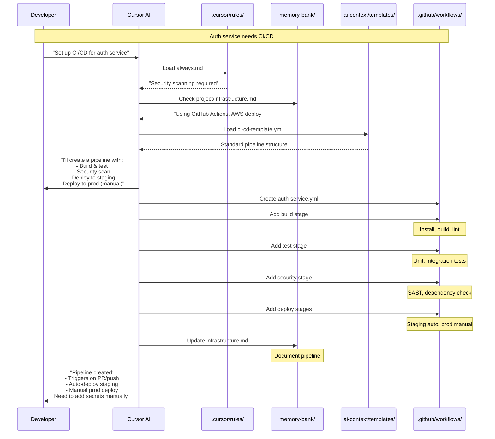

### Detailed Claude Code CI/CD Flow

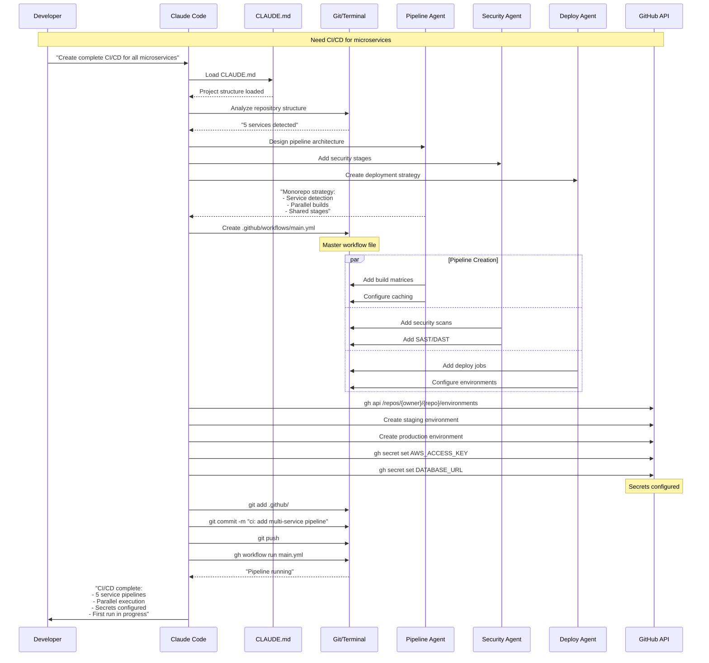

---

## Key Differences Summary

### Context Loading
| Aspect | Cursor | Claude Code |
|--------|--------|-------------|
| Initial Load | Rules (automatic) | CLAUDE.md (automatic) |
| Specifications | Manual reference | Manual reference |
| Memory Bank | Manual or via rules | Manual reference |
| Search | Exact paths needed | Fuzzy search works |

### Working Style
| Aspect | Cursor | Claude Code |
|--------|--------|-------------|
| Approach | Guided, interactive | Autonomous, parallel |
| Confirmation | Asks frequently | Executes more freely |
| Speed | Sequential | Parallel with sub-agents |
| Integration | Code-focused | Full terminal access |

### Best Practices
1. **Cursor**: Ideal for developers who want more control and step-by-step guidance
2. **Claude Code**: Better for experienced developers who want faster, autonomous execution
3. **Both**: Require good specifications and context setup for best results

Remember: The quality of your output depends on the quality of your input specifications and context setup!
